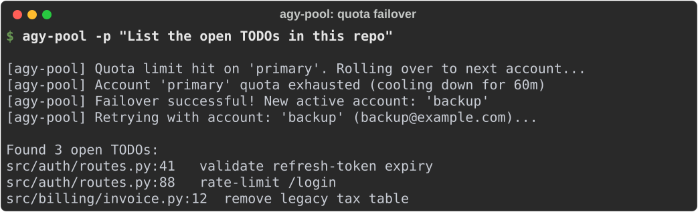
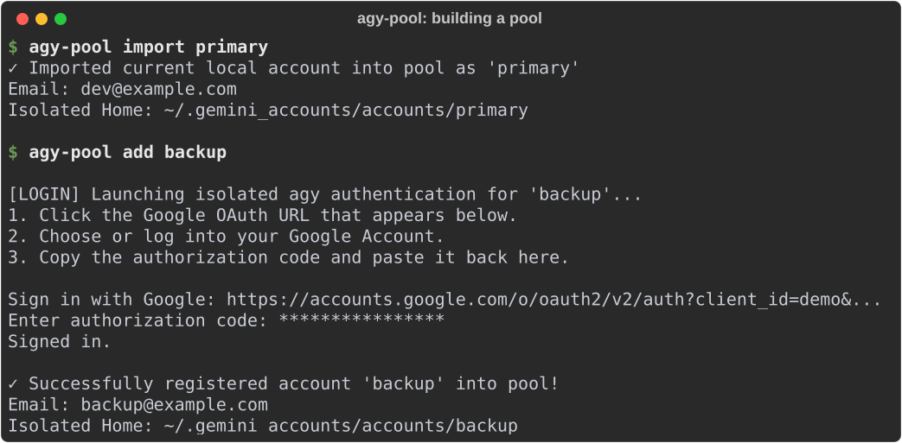
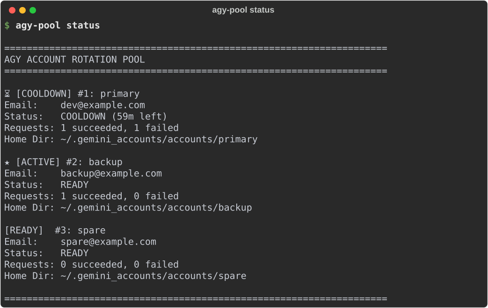
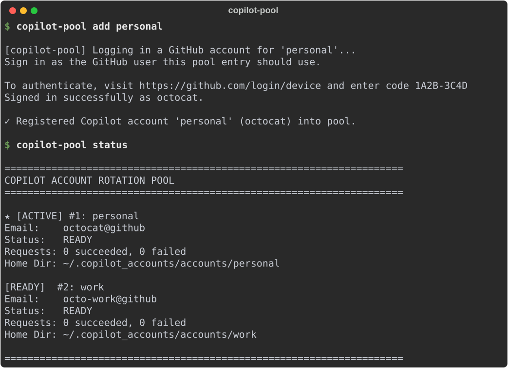

# agy-pool

Keeps several accounts for an AI coding CLI in one pool, and switches to the next account when the current one runs out of quota. It works with Google Antigravity (`agy`), Claude Code (`claude`) and the GitHub Copilot CLI (`copilot`). Your conversations, history and settings stay shared, whichever account is active.



## Contents

- [Why](#why)
- [Install](#install)
- [Quick start](#quick-start)
- [Commands](#commands)
- [How failover works](#how-failover-works)
- [Claude Code](#claude-code)
- [GitHub Copilot](#github-copilot)
- [Where things are stored](#where-things-are-stored)
- [Updating and uninstalling](#updating-and-uninstalling)
- [Troubleshooting](#troubleshooting)
- [Development](#development)

## Why

Long agent runs hit account limits: `429`, `RESOURCE_EXHAUSTED`, Claude's 5-hour and weekly caps. Juggling accounts by hand is awkward:

1. **Logins overwrite each other.** These CLIs keep one login per machine, often in the desktop keyring. Logging into a second account replaces the first.
2. **Workarounds break image paste.** Faking an SSH session to dodge the keyring makes `agy` think the terminal is remote, and pasting screenshots (`wl-paste`, `xclip`) stops working.
3. **History splits.** Giving each account its own config folder also gives it its own conversations, so `/resume` loses track when you switch.

agy-pool gives every account its own isolated home that holds only that account's login. Everything else (conversations, history, plugins, git and SSH config) is linked back to your real home.

## Install

You need Python 3.8+ (standard library only, no packages) on Linux or macOS, plus the CLI you want to pool. agy-pool has been tested on Linux.

```sh
curl -fsSL https://raw.githubusercontent.com/mr-ceo7/agy-pool/main/install.sh | bash
```

This copies the single `agy-pool` script to `~/.local/bin` and adds `claude-pool` and `copilot-pool` as links to it. If `~/.local/bin` isn't on your `PATH`, the installer prints the line to add.

Or install with pip:

```sh
pip install git+https://github.com/mr-ceo7/agy-pool.git
```

## Quick start

Import the account you're already logged into, then add more:

```sh
agy-pool import primary     # the account agy is logged into now
agy-pool add backup         # log in to another Google account
agy-pool status
```



`add` runs the agy login in a temporary home. Open the URL it prints, sign in with the other account, and paste the code back.

Then use `agy-pool` wherever you'd use `agy`. All arguments pass straight through:

```sh
agy-pool                                         # interactive session on the active account
agy-pool -p "Audit and refactor the auth routes" # one-shot prompt, with automatic failover
agy-pool -c                                      # any agy flag works
```



## Commands

The same commands work as `claude-pool …`, `copilot-pool …`, or `agy-pool claude …` / `agy-pool copilot …`.

| Command | What it does |
|---|---|
| `agy-pool [agy args]` | Run the CLI as the active account. Without `-p` it opens the interactive session |
| `agy-pool -p "<prompt>"` | Run a prompt; on a quota error, switch account and retry (also `--print`, `--prompt`) |
| `agy-pool import [name]` | Add the account the CLI is currently logged into (default name `primary`) |
| `agy-pool import-keyring [name]` | agy only: import the token stored in the desktop keyring (`secret-tool`) |
| `agy-pool add <name>` | Log in to a new account and add it |
| `agy-pool status` | List accounts, the active one, cooldowns and request counts (also `list`) |
| `agy-pool switch [name]` | Make `name` active, or move to the next account |
| `agy-pool test [name]` | Send a short test prompt with each account (or just `name`) and report the result (also `probe`) |
| `agy-pool remove <name>` | Remove an account **and delete its folder, including its login** (also `rm`, `delete`) |
| `agy-pool update [--check]` | Check for and install a newer version (also `upgrade`) |
| `agy-pool --version`, `--help` | Version, help |

## How failover works

- **Picking an account.** Each run uses the active account. If that account is cooling down, agy-pool moves to the next ready one in order. If every account is cooling down, it uses the one whose cooldown ends first.
- **Spotting a quota error.** Failover only happens with `-p` / `--print` / `--prompt`. agy-pool captures the CLI's error output and checks it for quota messages:
  - Claude: `429`, `rate_limit`, `usage_limit_reached`, `weekly limit`, `5-hour limit`, "limit … resets", `out_of_credits`, `overloaded_error`.
  - agy and Copilot: `429`, `RESOURCE_EXHAUSTED`, "quota exceeded", "rate limit", "too many requests", and similar.
- **Retrying.** On a quota error the account cools down for 60 minutes and the same command runs again on the next ready account. This repeats until a run succeeds or no ready account is left. Then the last error is shown and the CLI's exit code is returned.
- **Interactive sessions** start on the active account. They can't switch accounts mid-session; start a new one after the limit hits.
- **Output.** The answer streams to your terminal as usual. Error output is held back until the run finishes, so a failed attempt doesn't clutter the screen.
- **Changing the cooldown.** The length is `cooldown_seconds` in the pool's `accounts.json` (default `3600`).

## Claude Code

```sh
claude-pool status            # first run imports ~/.claude as "primary" and ~/.claude2 as "claude2", if present
claude-pool add work          # opens claude with a fresh config folder; log in when it asks
claude-pool import claude2    # import an existing config folder: ~/.claude2, or an absolute path
claude-pool switch work
claude-pool -p "Review the changes in src/"
```

Each account runs with `CLAUDE_CONFIG_DIR` pointing at its own folder. These are linked to your real `~/.claude`: your projects, file history, plugins, skills, sessions, session environment and shell snapshots.

## GitHub Copilot

```sh
copilot-pool import             # the user `copilot` is logged in as now, named after that GitHub user
copilot-pool add work           # runs `copilot login` for another GitHub user
copilot-pool status
copilot-pool -p "Explain this function" --allow-all-tools
```



Each account runs with `COPILOT_HOME` set to its own folder. That folder holds its own `config.json`, which records the logged-in GitHub user. Copilot keeps the token itself in the system keyring, filed under that user, so accounts for different GitHub users don't overwrite each other.

Two accounts for the same GitHub user share one quota; `add` warns you if you try this. These are linked to your real `~/.copilot`: session state and the session database, command history, installed plugins and tool permissions.

`copilot-pool import [name] [path]` can import from a Copilot home other than `~/.copilot`.

Copilot's non-interactive mode needs tool permissions such as `--allow-all-tools`. agy-pool passes your flags through unchanged and adds none.

## Where things are stored

| Tool | Pool folder | Each account runs with |
|---|---|---|
| agy | `~/.gemini_accounts` (or `$AGY_ACCOUNTS_DIR`) | `HOME` = the account folder |
| Claude Code | `~/.claude_accounts` | `CLAUDE_CONFIG_DIR` = the account folder |
| Copilot | `~/.copilot_accounts` | `COPILOT_HOME` = the account folder |

```text
~/.gemini_accounts/
├── accounts.json            pool state: accounts, active index, cooldowns, counters
├── accounts.json.lock       lock so several agy-pool processes can run at once
├── .update_check.json       when the last update check ran
└── accounts/
    └── primary/
        ├── .gitconfig -> ~/.gitconfig
        ├── .ssh -> ~/.ssh
        └── .gemini/
            ├── config -> ~/.gemini/config
            └── antigravity-cli/
                ├── antigravity-oauth-token        this account's login (copied, not linked)
                ├── settings.json, installation_id, antigravity_state.pbtxt
                ├── brain -> ~/.gemini/antigravity-cli/brain
                ├── conversations -> ~/.gemini/antigravity-cli/conversations
                ├── conversation_summaries.db -> …
                ├── history.jsonl -> …
                └── cache -> …
```

For agy, each run also sets `DBUS_SESSION_BUS_ADDRESS=disabled` so the desktop keyring can't hand over a different account's login. It removes `SSH_CONNECTION`, `SSH_CLIENT` and `SSH_TTY`, so image paste keeps working.

agy and Claude logins are copies of the CLI's token files, stored as plain files in these folders. Protect the pool folders the way you protect `~/.gemini` and `~/.claude`.

## Updating and uninstalling

agy-pool checks GitHub for a newer version at most once a day, in the background, and prints a notice when one exists. To update:

```sh
agy-pool update            # downloads the new script, checks it parses, and replaces the installed one
agy-pool update --check    # only report
```

If you installed with pip, update with `pip install --upgrade git+https://github.com/mr-ceo7/agy-pool.git` instead.

Uninstall:

```sh
curl -fsSL https://raw.githubusercontent.com/mr-ceo7/agy-pool/main/uninstall.sh | bash
```

This removes `agy-pool`, `claude-pool` and `copilot-pool` from `~/.local/bin` and keeps your pools. To delete those too, remove `~/.gemini_accounts`, `~/.claude_accounts` and `~/.copilot_accounts`.

## Troubleshooting

| Problem | Fix |
|---|---|
| `add` finishes with "Login was not completed" | The login wasn't finished before the CLI exited. Run `add` again and complete the browser sign-in |
| Failover never triggers | It only works with `-p`. Check that the CLI's error matches one of the patterns in [How failover works](#how-failover-works) |
| "All accounts are in quota cooldown" | Every account hit its limit within the last hour. Wait, add another account, or clear `cooldown_until` in `accounts.json` |
| Copilot `-p` asks for permission or fails | Pass `--allow-all-tools` (or the narrower `--allow-tool` flags) as you would with `copilot` |
| Copilot accounts act as the same user | Each pool entry must be logged in as a different GitHub user (check `copilot-pool status`) |
| `No accounts in pool, executing with default environment` | The pool is empty, so the plain CLI ran. Use `import` or `add` first |

## Development

```sh
git clone https://github.com/mr-ceo7/agy-pool.git
cd agy-pool
pip install pytest rich
pytest                          # unit tests
python scripts/screenshots.py   # regenerate docs/*.svg in a sandbox with stand-in CLIs
```

The code lives in `agy_pool/cli.py`, which pip installs. The top-level `agy-pool` file is an identical copy that `install.sh` and `agy-pool update` download. After editing `cli.py`, copy it over `agy-pool`; a test fails if they differ. Bump `VERSION` in `cli.py` (and in `agy_pool/__init__.py` and `pyproject.toml`) so installed copies see the update.

## License

MIT. See [LICENSE](LICENSE).
